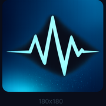

# AudioLink Reactive Site

<p align="center">
  
</p>

<p align="center">
  <strong>AudioLink Reactive の公式サイト・ドキュメント用リポジトリ</strong>
</p>

<p align="center">
  <a href="https://n4nsy.github.io/audiolink-reactive-site/">
    
  </a>
  <a href="https://n4nsy.booth.pm/">
    
  </a>
  
</p>

---

## Overview

**AudioLink Reactive Site** は、VRChatアバター向けUnity Editorツール  
**AudioLink Reactive** の案内・導入手順・ドキュメントを掲載するための静的Webサイトです。

AudioLink Reactive 本体のUnityコードは、このリポジトリには含まれていません。

---

## Links

| 種類 | URL |
|---|---|
| 公式サイト | https://n4nsy.github.io/audiolink-reactive-site/ |
| BOOTH | https://n4nsy.booth.pm/ |
| X | https://x.com/_N4NSY |

---

## Current Version

| Item | Value |
|---|---|
| Version | `v1.0.0` |
| Distribution | BOOTH / UnityPackage |
| Site Type | Static HTML / CSS / JavaScript |
| Hosting | GitHub Pages |

---

## Pages

| File | Description |
|---|---|
| `index.html` | AudioLink Reactive の概要、Download / Docs / Contact / Version への導線 |
| `download.html` | BOOTHからのUnityPackageダウンロード・導入案内ページ |
| `docs.html` | AudioLink Reactive の使い方・各機能説明 |
| `css/style.css` | サイト全体のスタイル定義 |

---

## Structure

```txt
.
├── index.html
├── download.html
├── docs.html
├── README.md
├── css/
│   └── style.css
├── js/
├── favicon.png
└── apple-touch-icon.png
```

---

## Notes

- 静的HTML / CSS / JavaScriptのみで構成
- GitHub Pagesで公開
- 日本語 / 英語の切り替えに対応
- AudioLink Reactive 本体はBOOTHからUnityPackage形式で配布
- このリポジトリには、AudioLink Reactive本体のUnityコードは含めない

---

## Release Notes

### v1.0.0

- AudioLink Reactive 初回公開版
- 配布形式を BOOTH / UnityPackage に変更
- 専用WindowによるAvatar指定に対応
- Renderer一覧から対象を追加可能
- Material単位で「光らせる」「膨らませる」を設定可能
- Editor上で確認できるPreview機能を追加
- Material単位の設定書き出し / 読み込みに対応
- 任意MaterialからAudioLink設定をインポートできる補助機能を追加
- Preview中の一時Material管理と復元処理を整理

---

## Development

ローカル確認は、`index.html` をブラウザで開いて行います。

GitHub Pages反映後は、以下のURLから確認します。

https://n4nsy.github.io/audiolink-reactive-site/

---

## Related

- BOOTH: https://n4nsy.booth.pm/
- X: https://x.com/_N4NSY
